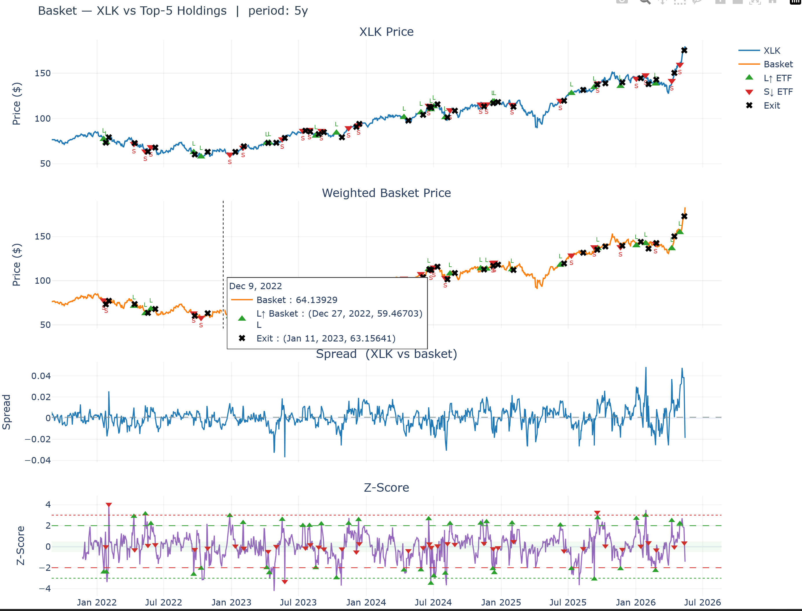
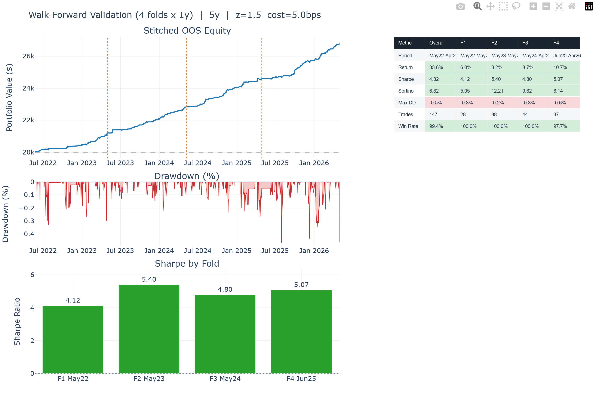
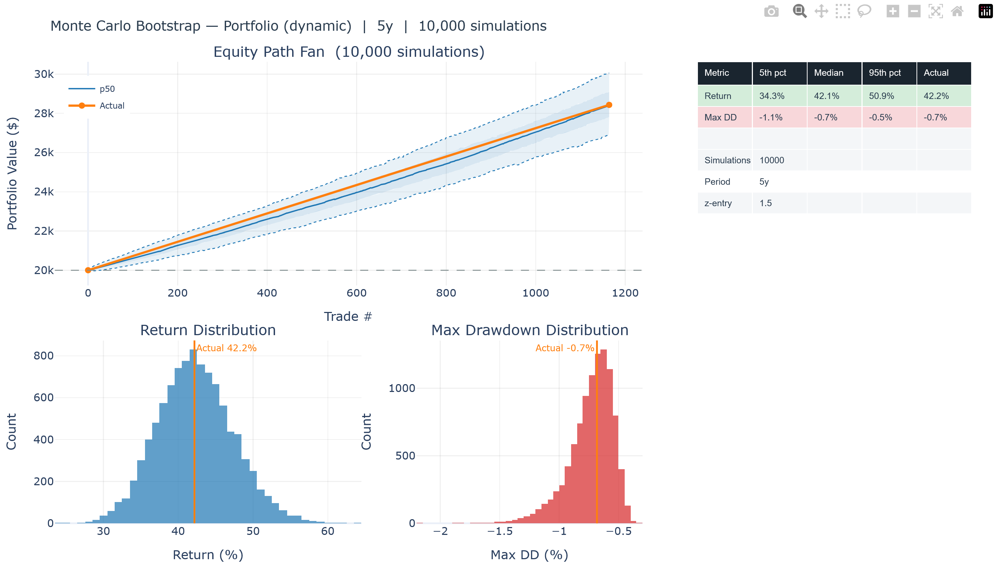
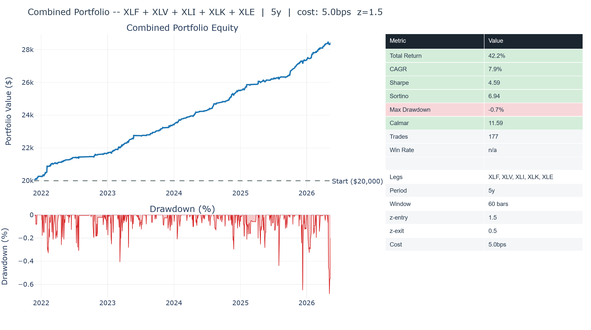
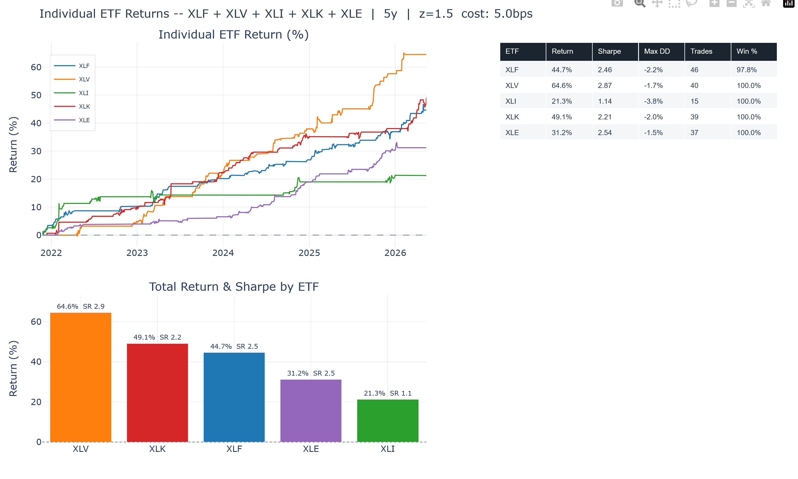
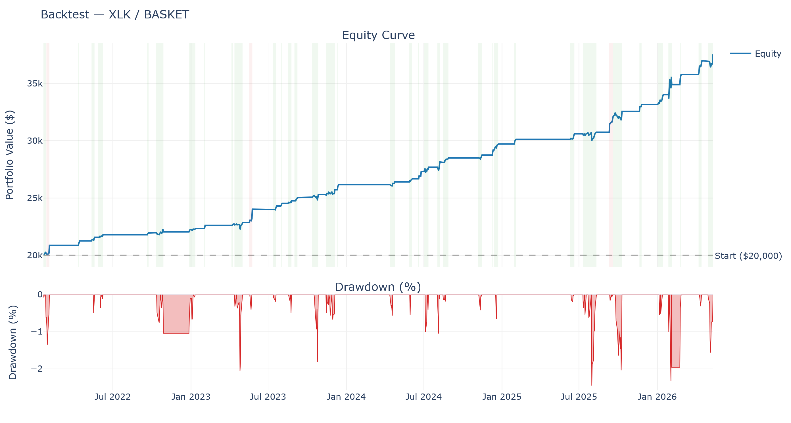

# Quantitative Trading Platform

A full-stack algorithmic trading system built from scratch in Python, covering signal research, backtesting, walk-forward validation, Monte Carlo analysis, and automated live execution via Alpaca paper trading.

The flagship strategy is **ETF basket arbitrage** — a mean-reversion approach that trades the spread between a sector ETF and a dynamically-updated basket of its top holdings, with historically correct constituent lists sourced directly from SEC EDGAR N-PORT filings to eliminate survivorship bias.

---

## Table of Contents

- [Overview](#overview)
- [Basket Strategy (Flagship)](#basket-strategy-flagship)
  - [How It Works](#how-it-works)
  - [Dynamic Constituents (EDGAR N-PORT)](#dynamic-constituents-edgar-n-port)
  - [Signal Generation](#signal-generation)
  - [Walk-Forward Validation](#walk-forward-validation)
  - [Monte Carlo Analysis](#monte-carlo-analysis)
  - [Sample Results](#sample-results)
- [Other Strategies](#other-strategies)
- [Live Trading (Alpaca Paper)](#live-trading-alpaca-paper)
- [Architecture](#architecture)
- [CLI Reference](#cli-reference)
- [Setup](#setup)

---

## Overview

| Component | Description |
|---|---|
| **Strategies** | ETF basket arbitrage, pairs trading, PCA stat-arb, CTA trend-following |
| **Data** | yfinance (historical), Alpaca Markets (live), SEC EDGAR (ETF constituents) |
| **Validation** | Walk-forward OOS testing, Monte Carlo bootstrap |
| **Execution** | Alpaca paper trading — currently in live testing phase |
| **Logging** | Automated trade journal to Google Sheets |
| **Charting** | Interactive Plotly dashboards (equity curves, spread z-scores, entry/exit markers) |

---

## Basket Strategy (Flagship)

### How It Works

The core idea is that a sector ETF (e.g. XLF) and its top constituent stocks are cointegrated — they share a long-run equilibrium. When macro or liquidity forces push the ETF temporarily above or below its fair value relative to its holdings, the spread tends to revert.

The strategy:
1. Fits a rolling OLS regression of ETF price against log-constituent prices (60-day window, re-estimated daily)
2. Computes a z-score of the residual spread
3. Enters a long/short position when |z| > 1.5, exits when |z| < 0.25, stops out at |z| > 2.5
4. Sizes positions against a 10% annualised spread volatility target
5. Enforces a 30-day maximum hold to prevent capital lock-up

```
ETF price = β₁·log(stock₁) + β₂·log(stock₂) + ... + βₙ·log(stockₙ) + α + ε

spread = ETF - fitted value
z-score = (spread - rolling_mean) / rolling_std

|z| > 1.5  →  enter  (long spread if z < -1.5, short if z > +1.5)
|z| < 0.25 →  exit
|z| > 2.5  →  stop loss
```

Five ETFs are traded simultaneously as an uncorrelated portfolio: **XLF** (Financials), **XLV** (Healthcare), **XLI** (Industrials), **XLK** (Technology), **XLE** (Energy).

---

### Dynamic Constituents (EDGAR N-PORT)

The most significant technical feature of the platform is **survivorship-bias correction** via SEC EDGAR N-PORT filings.

**The problem with static backtests:** If you use today's top-5 XLK holdings (NVDA, AAPL, MSFT, AVGO, PLTR) to backtest a 5-year strategy, you're implicitly assuming you knew in 2021 that PLTR would become a top-10 XLK holding. You didn't. Backtesting with today's winners retroactively inflates performance.

**The solution:** Every quarter, ETFs file their full holdings with the SEC as N-PORT-P reports. This platform fetches the complete filing history for each ETF and reconstructs the historically-accurate top-5 constituents at every point in time. When the basket composition changes (a new stock enters the top 5), the backtest seamlessly transitions to the new basket — using the old basket's spread for any open position until it reaches a natural exit, then switching to the new basket for new entries.

```
XLK constituent history (2021–2026):
  2021-06 → 2022-02:  AAPL, MSFT, V, NVDA, MA
  2022-02 → 2023-06:  AAPL, MSFT, NVDA, V, MA
  2023-06 → 2023-09:  MSFT, AAPL, NVDA, AVGO, CSCO    ← Visa/MA rotate out
  2023-09 → 2024-06:  AAPL, MSFT, NVDA, AVGO, ADBE
  2024-06 → 2025-03:  MSFT, AAPL, NVDA, AVGO, AMD/ORCL
  2025-11 → present:  NVDA, MSFT, AAPL, AVGO, PLTR    ← PLTR enters
```

This also powers the live daily trade script — at 4:30pm each day, the system queries EDGAR for today's actual top-5 holdings before placing any orders. No hardcoded stock lists.

---

### Signal Generation



The spread is estimated using **rolling OLS** (strictly backward-looking — no lookahead bias):

- At every date `t`, the regression is fit on only the `window` days ending at `t`
- Optional **ridge regularisation** (`--ridge-alpha`) prevents overfitting when the constituent/window ratio is high
- Optional **regime filter** (`--regime-filter`) detects structural breaks in basket relationships and suppresses entries during unstable periods
- Optional **VIX filter** (`--vix-filter`) suppresses new entries during high-volatility regimes

---

### Walk-Forward Validation

Out-of-sample performance is validated using a **walk-forward framework**: the most recent `period - 1 year` of data is withheld from parameter fitting and divided into `n` non-overlapping folds. Each fold is evaluated independently and the equity curves are stitched to form a single OOS track record.

```
5-year test, 4 folds (1y each):

[─── train (1y) ───][─ fold 1 ─][─ fold 2 ─][─ fold 3 ─][─ fold 4 ─]
 ↑ OLS calibration   ↑ pure OOS — never seen during parameter selection
```

The fold size is automatically computed from the period and number of folds (e.g. `--period 5y --walk-forward 2` gives two 2-year folds). Auto mode selects `period_years - 1` folds by default.



---

### Monte Carlo Analysis

After any backtest, `--monte-carlo` runs 10,000 bootstrap simulations by resampling the daily return stream. This answers the question: *"Was this result lucky, or is it robust?"*

Output reports the 5th/50th/95th percentile return and maximum drawdown across all simulations, giving a realistic range of outcomes under different sequencing of the same trades.



---

### Sample Results

All results below are **out-of-sample** walk-forward results using EDGAR dynamic constituents (survivorship-bias corrected):



**5-year dynamic walk-forward (4 folds × 1y, all 5 ETFs):**

| Fold | Period | Return | Sharpe |
|---|---|---|---|
| 1 | Jun 2022 – May 2023 | 6.0% | 4.12 |
| 2 | May 2023 – May 2024 | 8.2% | 5.40 |
| 3 | May 2024 – Apr 2025 | 8.7% | 4.80 |
| 4 | Jun 2025 – Apr 2026 | 10.7% | 5.07 |
| **Combined** | **5y OOS** | **33.6%** | **4.82** |

Max drawdown: **-0.5%** | 147 trades

**Monte Carlo (10,000 sims, 5y multi-basket):**

| Percentile | Return | Max DD |
|---|---|---|
| 5th | 34.3% | -1.1% |
| 50th | 42.1% | -0.7% |
| 95th | 50.9% | -0.5% |

The tight MC band reflects the high Sharpe and portfolio diversification across 5 uncorrelated sectors.

**Individual ETF results (dynamic, 5y full period):**



| ETF | Sector | Return | Sharpe | Max DD |
|---|---|---|---|---|
| XLF | Financials | 42.5% | 2.90 | -1.9% |
| XLV | Healthcare | 60.4% | 2.42 | -2.3% |
| XLI | Industrials | 65.0% | 2.66 | -3.0% |
| XLK | Technology | 87.8% | 2.82 | -2.5% |
| XLE | Energy | 32.3% | 2.79 | -1.8% |

Portfolio diversification lifts the combined Sharpe to ~4.6–5.1 — well above any individual leg — because the five sectors are largely uncorrelated.

*Single-basket example — XLK (Technology), 5y:*



---

## Other Strategies

### Pairs Trading (`pairs`)

Classic statistical arbitrage on two cointegrated assets. Uses rolling OLS to estimate the hedge ratio between the pair, with ADF cointegration testing and half-life estimation to determine the mean-reversion window. Supports walk-forward validation and an all-pairs scan mode that screens a universe for cointegrated candidates.

### PCA Statistical Arbitrage (`pca`)

PCA is fit on a universe of stocks to extract common systematic factors. The residual (idiosyncratic) return for each stock — the part unexplained by the factors — is z-scored over a rolling window. The strategy goes long the most oversold and short the most overbought idiosyncratic returns, betting on reversion to zero. Designed for larger universes where individual pair relationships may be unstable.

### CTA Trend-Following (`cta`)

A systematic momentum strategy using EWMAC (Exponentially Weighted Moving Average Crossover) signals across four timeframe pairs: (8,32), (16,64), (32,128), and (64,256) bars. Signals are combined using inverse-volatility weighting. Supports a regime filter that suppresses long equity exposure when SPY is below its 200-day moving average.

---

## Live Trading (Alpaca Paper)

The platform is currently in **live paper-trading testing** via Alpaca Markets. Each trading day after market close (4:30pm ET), a GitHub Actions workflow automatically:

1. Queries EDGAR N-PORT for the current top-5 holdings of each ETF
2. Fetches 1-year price history via the Alpaca data API
3. Computes the rolling spread z-score and evaluates signals
4. Places paper orders via the Alpaca trading API
5. Logs results (signal, z-score, orders) to a Google Sheets trade journal

```yaml
# .github/workflows/daily_trade.yml
on:
  schedule:
    - cron: "30 20 * * 1-5"   # 4:30 PM EDT Mon-Fri
```

The GitHub Action mirrors the production environment exactly, with Alpaca API keys injected via repository secrets. Paper trading results are accumulated to validate live signal quality before any transition to real capital.

---

## Architecture

```
Quant_Project/
│
├── run.py                        # Unified CLI entry point
│
├── src/
│   ├── strategies/
│   │   ├── basket/               # ETF basket arbitrage (flagship)
│   │   │   ├── backtest.py       # Single-segment + segmented backtest engine
│   │   │   ├── signals.py        # Z-score signal generation
│   │   │   └── viz.py            # Plotly dashboards (equity, spread, walk-forward)
│   │   ├── pairs/                # Pairs trading
│   │   ├── pca/                  # PCA stat-arb
│   │   └── cta/                  # Trend-following
│   │
│   ├── analytics/
│   │   └── basket.py             # Rolling OLS spread, ridge regression, regime filter
│   │
│   ├── data/
│   │   ├── fetcher.py            # yfinance wrapper with CSV caching
│   │   ├── edgar.py              # SEC EDGAR N-PORT constituent history
│   │   └── alpaca_fetcher.py     # Alpaca Markets price data
│   │
│   ├── backtest/
│   │   ├── portfolio_engine.py   # Metrics (Sharpe, drawdown, CAGR)
│   │   └── monte_carlo.py        # Bootstrap simulation
│   │
│   └── trading/
│       ├── alpaca_trader.py      # Alpaca order placement
│       ├── journal.py            # Google Sheets trade log
│       └── rebalancer.py        # Position rebalancing
│
├── scripts/
│   └── daily_trade.py            # Daily automation script
│
└── .github/workflows/
    └── daily_trade.yml           # GitHub Actions scheduler
```

---

## CLI Reference

```bash
# Basket strategy — dynamic constituents (default), 5-year backtest
python run.py basket --etf XLF --period 5y

# Multi-basket portfolio — all 5 sectors, walk-forward validation
python run.py basket-multi --period 5y --walk-forward \
  --basket XLF: --basket XLV: --basket XLI: --basket XLK: --basket XLE:

# Walk-forward with 2 long (2-year) folds + Monte Carlo
python run.py basket-multi --period 5y --walk-forward 2 --monte-carlo \
  --basket XLF: --basket XLV: --basket XLI: --basket XLK: --basket XLE:

# Static mode (fixed constituents, opt-in)
python run.py basket --static --etf XLF --stocks BRK-B JPM V MA BAC --period 5y

# Pairs trading
python run.py pairs --pair GLD/GDX --period 3y --backtest

# PCA stat-arb
python run.py pca --universe sp500 --period 2y --n-factors 5 --top-n 10

# CTA trend-following
python run.py cta --universe equities --period 5y --regime-filter

# Daily trade dry-run (preview signals without placing orders)
PYTHONPATH=$(pwd) python scripts/daily_trade.py
```

---

## Setup

**Requirements:** Python 3.12+

```bash
git clone https://github.com/grifcollier/Quant_Project.git
cd Quant_Project
pip install -r requirements.txt
```

**Environment variables** (for live trading and journaling):

```bash
ALPACA_API_KEY=...          # Alpaca live account key (market data)
ALPACA_SECRET_KEY=...       # Alpaca live account secret
ALPACA_PAPER_KEY=...        # Alpaca paper trading key (order placement)
ALPACA_PAPER_SECRET=...     # Alpaca paper trading secret
GOOGLE_SHEETS_CREDS=...     # Google service account JSON (base64)
GOOGLE_SHEET_ID=...         # Target spreadsheet ID
```

No API keys are needed for backtesting — historical data is fetched from yfinance and cached locally.

---

*Built with Python · pandas · statsmodels · Plotly · Alpaca · SEC EDGAR*
